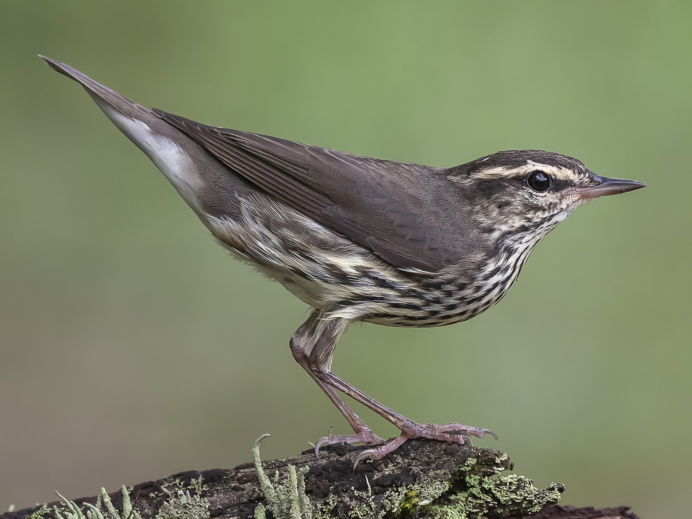
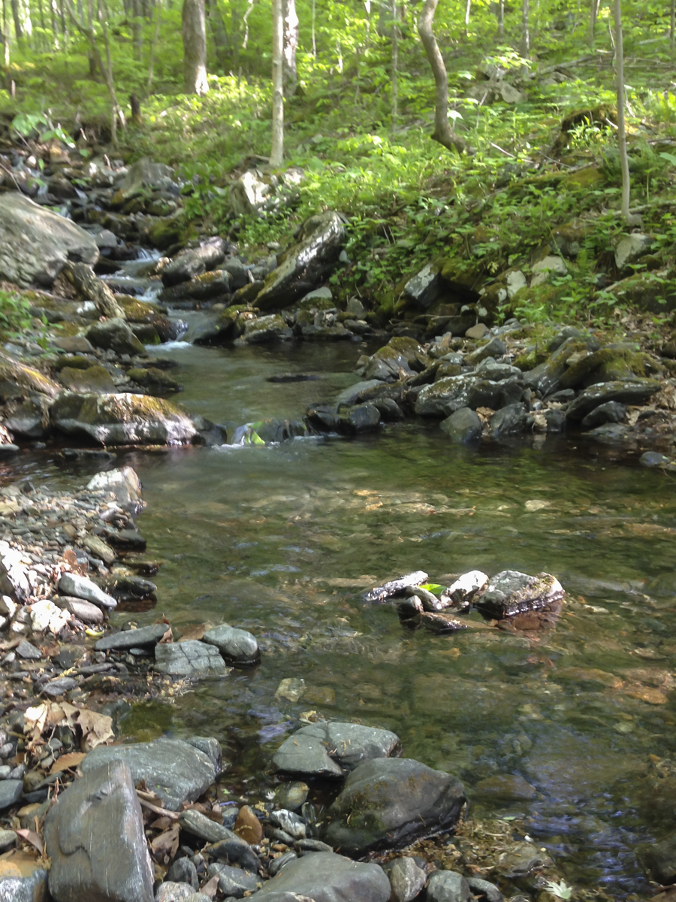
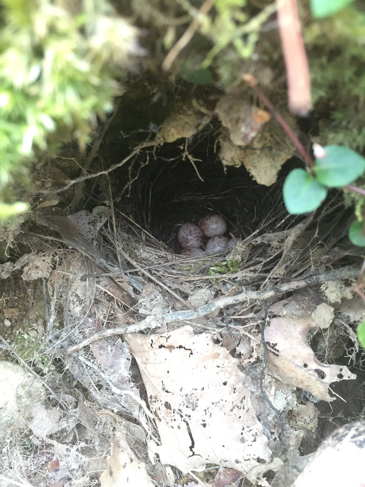

<body style = "background-color:#b1d3aa">


```{r setup, include=FALSE}
knitr::opts_chunk$set(echo = TRUE)
packages_needed <- c("ggplot2", # graphics
                     "dplyr",
                     "arm", # display() etc.
                     "MASS",
                     "ggfortify",
                     "nlme",
                     "lme4",
                     "lmerTest",
                     "asbio",
                     "see",
                     "patchwork"
                     )
pk_to_install <- packages_needed [!( packages_needed %in% rownames(installed.packages())  )]
if(length(pk_to_install)>0 ){
  install.packages(pk_to_install,repos="http://cran.r-project.org")
}
#lapply(packages_needed, require, character.only = TRUE)
library(ggplot2)
library(dplyr)
library(lme4)
library(lmerTest)
library(ggfortify)
library(MuMIn)
library(asbio)
library(GGally)
library(performance)
library(patchwork)
library(janitor)
```


<span style="font-size:25px">Example 1 - Annual Return of LOWA</span>

$~$

{width=50%}  


{width=50%}

$~$

First, I imported the data and cleaned it up. I then checked for correlation among the variables.

$~$

```{r Data and Plot, message=FALSE, warning=FALSE}

lowa_return <- read.csv("data/lowa_return_data.csv")
lowa_return <- clean_names(lowa_return)
lowa_return <- na.omit(lowa_return)

Veg <- lowa_return[, c("phem", "leaflit", "wdfl", "decgv", "evergv", "treeb")]

ggpairs(Veg) + theme_classic()

```

It seems that the proportion of hemlock at the study site (phem) is correlated with leaf litter and deciduous ground vegetation (decgv). Based on this, I modeled the data and checked for collinearity. 

$~$

```{r Model}

model_lowa1 <- lm(i_return ~ phem + leaflit + wdfl + decgv + evergv + treeb, data=lowa_return)
anova (model_lowa1)

```
```{r Multicollinearity}

performance::check_collinearity(model_lowa1)

```
$~$
Thankfully, all of the variables seem to have low correlation.

```{r Judge Dredge}

options(na.action = "na.fail") # otherwise blows up with NA values
dredge_lowa<-dredge(model_lowa1)
dredge_lowa

```
$~$ 
Because of the large(ish) amount of models, I decided to subset all models with a delta AIC less than 5. When that still returned a fair amount, I subsetted all of those with a delta AIC less than 2.

$~$
```{r Dredge}

subset(dredge_lowa, delta <5)

```

```{r Competitive Models}

subset(dredge_lowa, delta<2)

```

```{r Which Variables?}

importance(dredge_lowa)

```
$~$
Only three models had a delta AIC less than 2. The two most important variables were the percentage of deciduous ground vegetation and the percentage of live tree boles. Both appeared in 32 of the 64 models. 


```{r Average Models}

model.avg(dredge_lowa, revised.var = TRUE)

```

```{r Summary}

summary(model.avg(dredge_lowa, subset = delta <2 ))

```
$~$
The summary just further reinforces that deciduous ground vegetation and live tree boles are the two most important variables, with both having significant effects on whether birds return to the previous season's nesting site. 

$~$


```{r Plots, message=FALSE, warning=FALSE, fig.width=4, fig.height=10}

l1 <- ggplot(lowa_return, aes(decgv, i_return)) +
  geom_point() +
  geom_smooth(method="glm", method.args=list(family="binomial"(link="logit")))  
 
l2 <- ggplot(lowa_return, aes(treeb, i_return)) +
  geom_point() +
  geom_smooth(method="glm", method.args=list(family="binomial"(link="logit"))) 

l3 <- ggplot(lowa_return, aes(leaflit, i_return)) +
  geom_point() +
  geom_smooth(method="glm", method.args=list(family="binomial"(link="logit"))) 

l4 <- ggplot(lowa_return, aes(wdfl, i_return)) +
  geom_point() +
  geom_smooth(method="glm", method.args=list(family="binomial"(link="logit"))) 

l5 <- ggplot(lowa_return, aes(phem, i_return)) +
  geom_point() +
  geom_smooth(method="glm", method.args=list(family="binomial"(link="logit"))) 

l6 <- ggplot(lowa_return, aes(evergv, i_return)) +
  geom_point() +
  geom_smooth(method="glm", method.args=list(family="binomial"(link="logit")))

l1 / l2 / l3 / l4 / l5 / l6
```


<span style="font-size:25px">Example 2 - Nest Survival</span>
$~$

{width=50%}

```{r Example 2 Data and Plot, message=FALSE, warning=FALSE}

lowa_survival <- read.csv("data/lowa_nest_survival.csv")
lowa_survival <- clean_names(lowa_survival)
lowa_survival <- na.omit(lowa_survival)

surv <- lowa_survival[, c("phem", "leaflit", "wdfl", "decgv", "evergv", "treeb")]

ggpairs(surv) + theme_classic()

```

```{r Survival Model}

model_lowa2 <- lm(f ~ phem + leaflit + wdfl + decgv + evergv + treeb, data=lowa_survival)
anova (model_lowa2)

```

```{r Multicolinearity 2}

performance::check_collinearity(model_lowa2)

```

```{r Dreddge feat. Karl Urban}

options(na.action = "na.fail") # otherwise blows up with NA values
dredge_lowa2 <- dredge(model_lowa2)
dredge_lowa2

```


```{r Dredge Again}

subset(dredge_lowa2, delta<2)

```

```{r Which Variable is Best?}

importance(dredge_lowa2)

```

```{r Average Models Round 2}

model.avg(dredge_lowa2, revised.var = TRUE)

```

```{r Summarize}

summary(model.avg(dredge_lowa2, subset = delta <2 ))

```

```{r Plots Again, message=FALSE, warning=FALSE, fig.width=4, fig.height=10}

l7 <- ggplot(lowa_survival, aes(decgv, f)) +
  geom_point() +
  geom_smooth(method="glm", method.args=list(family="binomial"(link="logit")))  
 
l8 <- ggplot(lowa_survival, aes(treeb, f)) +
  geom_point() +
  geom_smooth(method="glm", method.args=list(family="binomial"(link="logit"))) 

l9 <- ggplot(lowa_survival, aes(leaflit, f)) +
  geom_point() +
  geom_smooth(method="glm", method.args=list(family="binomial"(link="logit"))) 

l10 <- ggplot(lowa_survival, aes(wdfl, f)) +
  geom_point() +
  geom_smooth(method="glm", method.args=list(family="binomial"(link="logit"))) 

l11 <- ggplot(lowa_survival, aes(phem, f)) +
  geom_point() +
  geom_smooth(method="glm", method.args=list(family="binomial"(link="logit"))) 

l12 <- ggplot(lowa_survival, aes(evergv, f)) +
  geom_point() +
  geom_smooth(method="glm", method.args=list(family="binomial"(link="logit")))

l7 / l8 / l9 / l10 / l11 / l12
```

</body>